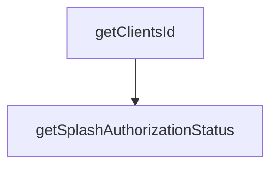

# Meraki Splash Page Authorization Status

## What is it ?
Example of python script to get the status of splash page authorization status :
```
└── clientsSplashAuthorizationStatuses (list)
    ├── clientId (text)
    └── splashAuthorizationStatus (object)
        └── ssids (list)
            └── <SSID Number> (object)
                └──isAuthorized (boolean)
```


## Prerequisites
- Meraki Dashboard access
- Meraki API key
- Meraki network ID

## Get started
1. Clone or download this repo
```console
git clone https://github.com/xaviervalette/meraki_splash_page_authorization_status

```
2. Install required packages
```console
python3 -m pip install -r requirements.txt
```
3. Add a ```config.yml``` file as follow:
```diff
└── meraki_splash_page_authorization_status/
+   ├── config.yml
    ├── requirements.txt
    └── src/
         ├── functions.py
         └── main.py  
```
4. In the ```config.yml``` file, add the following variables:
```yaml
#config.yml
---
apiKey: "<yourApiKey>"
networkId: "<yourNetworkId1>"
...

```

5. Now you can run the code by using the following command:
```console
python3 src/main.py
```

## Output
The output should be as followed:
```console
(venv) xvalette@XVALETTE-M-V1WU cisco-meraki-splash-access % python3 src/main.py
{
    "clientsSplashAuthorizationStatuses": [
        {
            "clientId": "clientId1",
            "splashAuthorizationStatus": {
                "ssids": {
                    "2": {
                        "isAuthorized": false
                    }
                }
            }
        },
        {
            "clientId": "clientId2",
            "splashAuthorizationStatus": {
                "ssids": {
                    "2": {
                        "isAuthorized": false
                    }
                }
            }
        },
        ...
        {
            "clientId": "clientIdN",
            "splashAuthorizationStatus": {
                "ssids": {
                    "2": {
                        "isAuthorized": false
                    }
                }
            }
        }
    ]
}
```


